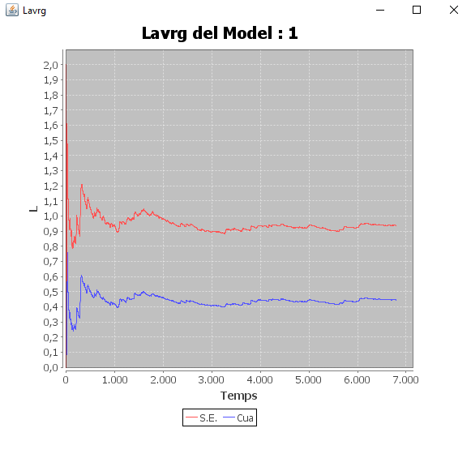

```{r setup, include=FALSE}
knitr::opts_chunk$set(echo = TRUE)
```

## Apartat 1

```{r Ap1}
A13 <- read.table("C:/Users/roger.garcia.arque/Downloads/P3/A13.DAT")

A13<-A13$V1

S5 <- read.table("C:/Users/roger.garcia.arque/Downloads/P3/S5.DAT")

S5<-S5$V1

m_a <- mean(A13)

m_s <- mean(S5)

lambda_a <- 1/m_a

mu_s <- 1/m_s

rho <- lambda_a/mu_s


p_0 <- 1 - rho

L_sist <- rho / (1- rho)

L_qua <- rho^2 / (1 - rho)

W_sist <- L_sist/ lambda_a

W_qua <- L_qua / lambda_a
```

## Apartat 2

Feta la simulació amb 20000 clients tenim que els valors obtinguts s'assemblen molt als que tenim fent la estimació amb la nostra mostra.

Pensem que els valors han estat molt semblant pel nombre de clients amb que s'ha fet la simulació

rho estimat = 0.48977 i rho_simulat = 0.4844

L estimat = 0.9599 i L_simulat=0.9271 L estimat en cua = 0.470132 i Lsimulat en cua = 0.4428 W estimat = 3.2341 i W_simulat=3.1517 W_estimat en cua = 1.58399 i W_simulat en cua= 1.5054

## Apartat 3



Com podem observar al gràfic el valor de Lsistavg s'estabilitza al llarg del temps , aixó es el que s'espera quan el factor de càrrega pot asumir les arribades. 
En el nostre cas el factor de càrrega és de 0.48977 amb la qual cosa el sistema pot atendre les peticions i arriba a un nombre mig de clients al sistema estable.

